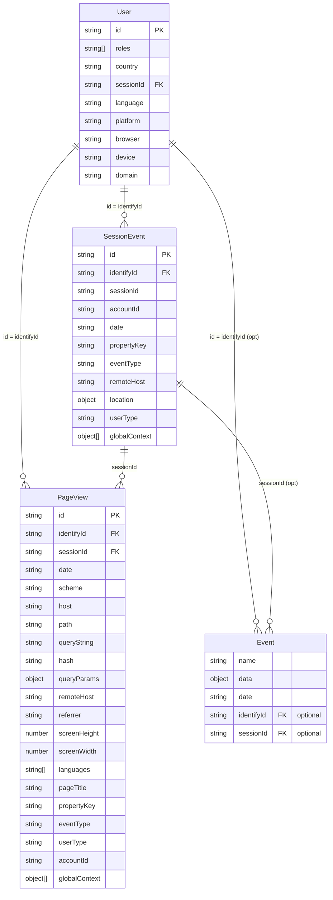

#  Model ER Diagram

```mermaid
erDiagram
    User {
        string id PK
        string[] roles
        string country
        string sessionId FK
        string language
        string platform
        string browser
        string device
        string domain
    }

    SessionEvent {
        string id PK
        string identifyId FK
        string sessionId
        string accountId
        string date
        string propertyKey
        string eventType
        string remoteHost
        object location
        string userType
        object[] globalContext
    }

    PageView {
        string id PK
        string identifyId FK
        string sessionId FK
        string date
        string scheme
        string host
        string path
        string queryString
        string hash
        object queryParams
        string remoteHost
        string referrer
        number screenHeight
        number screenWidth
        string[] languages
        string pageTitle
        string propertyKey
        string eventType
        string userType
        string accountId
        object[] globalContext
    }

    Event {
        string name
        object data
        string date
        string identifyId FK "optional"
        string sessionId FK "optional"
    }

    User ||--o{ SessionEvent : "id = identifyId"
    User ||--o{ PageView : "id = identifyId"
    User ||--o{ Event : "id = identifyId (opt)"
    SessionEvent ||--o{ PageView : "sessionId"
    SessionEvent ||--o{ Event : "sessionId (opt)"
```
