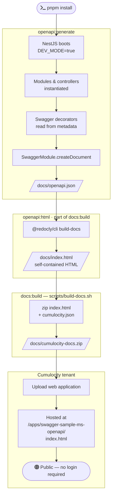

# swagger-sample-ms — NestJS OpenAPI PoC

This project is a **proof of concept** Cumulocity microservice showing how to automatically derive an OpenAPI specification from a NestJS application and publish that spec as a hosted HTML page on a Cumulocity tenant — without requiring any login.

---

## Why Swagger Annotations Matter

NestJS does not generate an OpenAPI spec by introspecting compiled JavaScript. It reads **TypeScript decorators at runtime** from `@nestjs/swagger`. This means every piece of documentation you want to appear in the final JSON must be explicitly declared in your source code using these annotations.

### Controller-level annotations

| Decorator | Purpose |
|-----------|---------|
| `@ApiTags("items")` | Groups all routes in this controller under the `items` tag in the Swagger UI |
| `@ApiBasicAuth()` | Marks every route in the controller as requiring Basic Auth and shows the 🔒 lock icon |

### Route-level annotations

| Decorator | Purpose |
|-----------|---------|
| `@ApiOperation({ summary, description })` | Sets the human-readable title and long description shown for the endpoint |
| `@ApiQuery({ name, required, description, enum })` | Documents a query string parameter including its type and constraints |
| `@ApiParam({ name, description, example })` | Documents a path parameter (`:id` style) |
| `@ApiBody({ type })` | Documents the request body, pointing to a DTO class |
| `@ApiResponse({ status, description, type })` | Documents one or more possible response shapes |

### DTO / model annotations

| Decorator | Purpose |
|-----------|---------|
| `@ApiProperty({ description, example, enum })` | Documents a required field — included in the generated schema |
| `@ApiPropertyOptional(...)` | Same as `@ApiProperty` but marks the field as optional in the schema |

These annotations are what get serialised into `docs/openapi.json`. **If a field or parameter is not annotated, it will not appear in the spec or docs.**

---

## How the OpenAPI JSON is Generated (`openapi:generate`)

Generating the spec requires actually **booting the NestJS application** — there is no static analysis step. NestJS collects all decorator metadata at runtime by importing every module and controller, then `@nestjs/swagger` walks the metadata to build the OpenAPI object.

```bash
pnpm run openapi:generate
```

Internally this runs:

```
DEV_MODE=true GENERATE_API_DOCS=true nest start
```

`DEV_MODE=true` bypasses the Cumulocity bootstrap credential fetch so the app can start without a live tenant. When `GENERATE_API_DOCS=true` the app:

1. **Boots normally** — all modules, controllers, providers, and guards are instantiated.
2. **`DocumentBuilder`** in `main.ts` constructs the top-level spec metadata (title, version, auth scheme).
3. **`SwaggerModule.createDocument(app, config)`** traverses every registered controller and its decorator metadata to produce the full OpenAPI object.
4. **Writes** the result to `docs/openapi.json`.
5. **Exits immediately** — the HTTP server is never started.

> ⚠️ The app must be able to start successfully for this command to work. All required providers and modules must resolve without errors.

---

## How the HTML Is Generated (`openapi:html`)

Once `docs/openapi.json` exists, a standalone HTML file is built using [Redocly CLI](https://redocly.com/docs/cli/):

```bash
pnpm run openapi:html
```

Internally this runs:

```
npx @redocly/cli build-docs ./docs/openapi.json -o ./docs/index.html
```

Redocly reads the JSON spec and produces a **self-contained single-file HTML page** — all CSS, JavaScript, and the spec data are inlined. No external network requests are needed at runtime.

---

## Publishing as a Cumulocity Web Application (Plugin)

The generated HTML can be deployed as a Cumulocity web application. Because it is a plain static file it **does not require any authentication** — users can browse the API docs without logging into the tenant.

### The `docs/cumulocity.json` manifest

`docs/cumulocity.json` is the manifest for the **static docs web application** (not the microservice). It defines the application name, context path, content-security-policy, and access settings:

```json
{
  "name": "swagger-sample-ms-openapi",
  "contextPath": "swagger-sample-ms-openapi",
  "noLogin": true,
  "contentSecurityPolicy": "..."
}
```

| Property | Value | Purpose |
|----------|-------|---------|
| `contextPath` | `"swagger-sample-ms-openapi"` | Determines the URL path on the tenant |
| `noLogin` | `true` | Serves the application without requiring the user to log in |
| `contentSecurityPolicy` | (see file) | Allows Redoc to load fonts and scripts correctly |

The `contextPath` determines the URL on the tenant:
```
https://<tenant-domain>/apps/swagger-sample-ms-openapi/index.html
```

> Note: The root-level `cumulocity.json` is the **microservice** manifest used when deploying the NestJS backend itself. It is a separate file from `docs/cumulocity.json`.

### Building the deployable zip

```bash
pnpm run docs:build
```

Internally `scripts/build-docs.sh`:

1. Verifies `docs/openapi.json` exists (error if missing — run `openapi:generate` first).
2. Runs `@redocly/cli build-docs` to produce `docs/index.html`.
3. Creates `docs/cumulocity-docs.zip` containing exactly two files:
   - `cumulocity.json` — the application manifest
   - `index.html` — the self-contained Redoc page

### Uploading to Cumulocity

In the Cumulocity tenant:

1. Open **Administration → Ecosystem → Applications**.
2. Click **Add application → Upload web application**.
3. Upload `docs/cumulocity-docs.zip`.
4. The application is immediately available at:
   ```
   https://<tenant-domain>/apps/swagger-sample-ms-openapi/index.html
   ```

No login or role is required to view the page.

---

## Full Workflow



### Commands

```bash
# 1. Install dependencies
pnpm install

# 2. Boot the app to collect all decorator metadata and write the spec
pnpm run openapi:generate
#    → writes docs/openapi.json

# 3. Build a standalone HTML page from the spec (also runs inside docs:build)
pnpm run openapi:html
#    → writes docs/index.html

# 4. Package the HTML + manifest into a deployable zip
pnpm run docs:build
#    → writes docs/cumulocity-docs.zip

# 5. Upload docs/cumulocity-docs.zip to your Cumulocity tenant
#    Administration → Ecosystem → Applications → Add application → Upload web application
```

---

## Project Structure

```
src/
  api/
    items/
      items.controller.ts   ← controller with all Swagger annotations
      items.dto.ts          ← DTOs with @ApiProperty annotations
  logger/
    no-color.logger.ts      ← NestJS logger that strips ANSI colour codes
  service/
    c8y-bootstrap.service.ts    ← fetches Cumulocity microservice bootstrap credentials
    c8y-client-provider.service.ts ← provides an authenticated @c8y/client instance
    dev-mode.service.ts         ← reads DEV_MODE env var to skip auth in development
  bootstrap.module.ts       ← declares the three services above
  app.module.ts             ← root module, imports BootstrapModule and registers controllers
  main.ts                   ← boots the app; generates the OpenAPI spec when GENERATE_API_DOCS=true

docs/
  openapi.json              ← generated spec (committed for reference)
  index.html                ← generated Redoc HTML
  cumulocity.json           ← web-app manifest for the static docs upload
  cumulocity-docs.zip       ← deployable zip (index.html + cumulocity.json)

scripts/
  build-docs.sh             ← runs openapi:html then zips the output
  build.sh                  ← builds the Docker image and packages it with cumulocity.json

cumulocity.json             ← microservice manifest (separate from docs/cumulocity.json)
Dockerfile                  ← multi-stage Docker build for the NestJS microservice
sample.env                  ← environment variable template (copy to .env for local dev)
```

---

## Environment Variables

Copy `sample.env` to `.env` before running locally:

```bash
cp sample.env .env
```

| Variable | Required | Description |
|----------|----------|-------------|
| `C8Y_BASEURL` | Yes (prod) | Base URL of the Cumulocity tenant, e.g. `https://your-tenant.cumulocity.com` |
| `C8Y_TENANT` | Yes (prod) | Tenant identifier, e.g. `t1234` |
| `C8Y_USER` | Yes (prod) | Cumulocity user for bootstrap credential lookup |
| `C8Y_PASSWORD` | Yes (prod) | Password for the above user |
| `DEV_MODE` | No | Set `true` to skip auth and use `DEV_MODE_DOMAIN_*` values |
| `DEV_MODE_DOMAIN_URL` | Dev only | Tenant URL used when `DEV_MODE=true` |
| `DEV_MODE_DOMAIN_ID` | Dev only | Tenant ID used when `DEV_MODE=true` |

---

## Local Preview

To preview the API docs in your browser without deploying:

```bash
npx @redocly/cli preview-docs docs/openapi.json
```

Or simply open `docs/index.html` in a browser after running `openapi:html`.

The running app also serves an **interactive Swagger UI** at:
```
http://localhost:3000/api-docs
```

---

## Development

```bash
pnpm install        # install dependencies
pnpm run start      # start in watch mode (DEV_MODE=true, port 3000)
pnpm run test       # run unit tests
pnpm run lint       # lint and auto-fix
pnpm run build      # compile TypeScript to dist/
```

### Docker / Microservice Build

To build and package the microservice for Cumulocity deployment:

```bash
pnpm run build:image
#    → builds a linux/amd64 Docker image tagged swagger-sample-ms:local
#    → saves image.tar and creates swagger-sample-ms.zip (image + cumulocity.json)
```

Upload `swagger-sample-ms.zip` via **Administration → Ecosystem → Microservices → Add microservice**.
